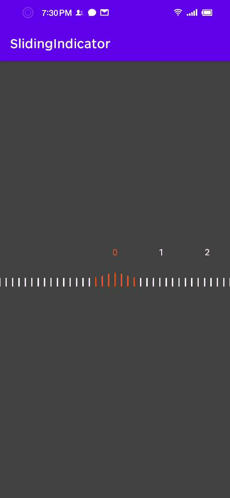

# SlidingIndicator

## 简介

少啰嗦，看东西！

 

`SlidingIndicator` 是一个自定义滑动指示器控件，可很方便地与 `RecyclerView` 实现联动。

## 用法

#### 1. 在 build.gradle 添加依赖

```gradle
dependencies {
	implementation 'com.dylanc:slidingindicator:0.1.0'
}
```

#### 2. 在 xml 添加 SlidingIndicator

```xml
<com.dylanc.slidingindicator.SlidingIndicator
    android:id="@+id/sliding_indicator"
    android:layout_width="match_parent"
    android:layout_height="wrap_content"/>
```

可对控件进行自定义，以下是自定义属性：


| 自定义属性        |       类型       | 作用                             |
| ----------------- | :--------------: | -------------------------------- |
| scaleHeight       |    dimension     | 刻度高度                         |
| scaleWidth        |    dimension     | 刻度宽度                         |
| scaleSpan         |    dimension     | 相邻两刻度的间距大小             |
| pointerHeight     |    dimension     | 指针高度                         |
| waveLength        |    dimension     | 波浪长度                         |
| intervalSpanCount |     integer      | 两个索引之间的刻度数量           |
| selectedIndex     |     integer      | 选中的位置                       |
| maxValue          |     integer      | 最大的                           |
| extraScaleCount   |     integer      | 最左端和最右端增加额外的刻度数量 |
| scaleColor        |      color       | 刻度颜色                         |
| selectedColor     |      color       | 选中的刻度颜色                   |
| scaleStyle        | roundCap, square | 刻度主题，矩形或圆帽子           |

#### 3. 如果需要与 RecyclerView 联动

下面例子是与一个水平列表进行联动，每个子项的宽度是列表宽度的 1/5 ，完整的实现可参考[示例代码](https://github.com/DylanCaiCoding/SlidingIndicator/blob/master/app/src/main/java/com/dylanc/slidingindicator/sample/MainActivity.kt)。

```kotlin
recycler_view.addOnScrollListener(object : RecyclerView.OnScrollListener() {
  override fun onScrolled(recyclerView: RecyclerView, dx: Int, dy: Int) {
    sliding_indicator.scrollTo(dx.toFloat() / recyclerView.measuredWidth * 5)
  }
})
sliding_indicator.doOnSelected { position ->
  adapter.selectAt(position)
}
sliding_indicator.doOnScrolled { position, offsetValue ->
  linearLayoutManager.scrollToPositionWithOffset(
    position,
    (recycler_view.measuredWidth / 5 * offsetValue).toInt()
  )
}
```
